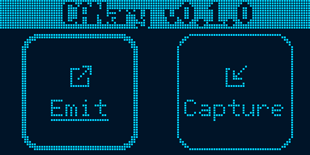
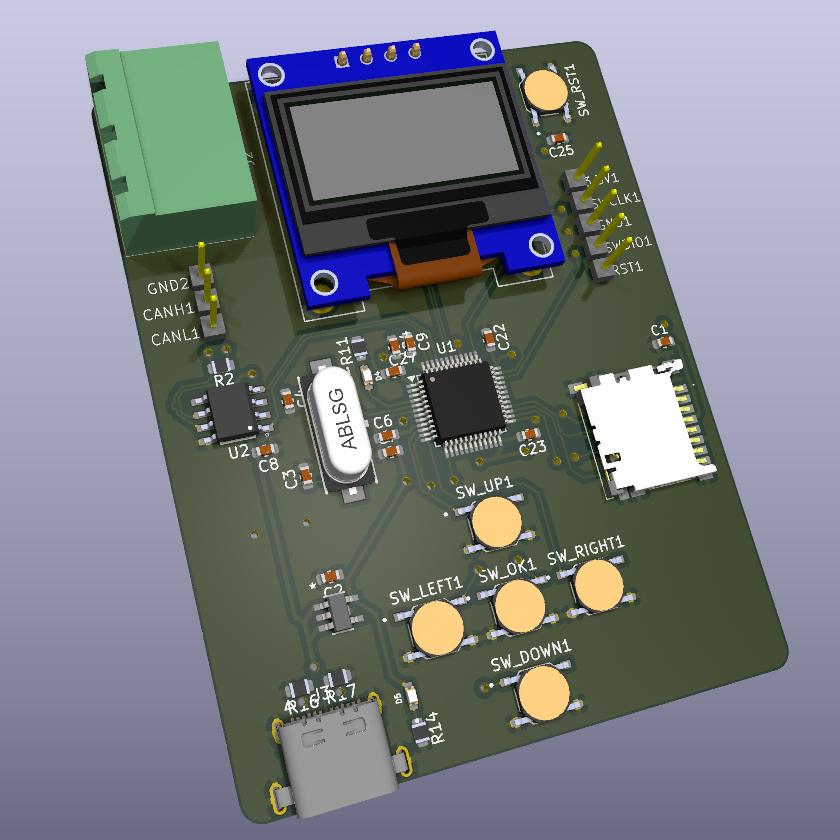

# CANary firmware

Le firmware CANary est le firmware pour le projet CANary. Ce projet vise à créer un émetteur et enregistreur de bus CAN indépendant.

<p align="center">


</p>

Ce firmware est fait pour un STM32F103CB et contient un interface graphique, un contrôleur de bus CAN et un explorateur de carte SD. Un transceiver CAN doit être utilisé en conjonction du STM32 pour pouvoir s'interfacer avec le bus CAN.

## Compilation et flashage

### Compiler le firmware

Pour compiler le firmware, assurez vous d'avoir l'architecture cible `thumbv7m-none-eabi` installée pour votre toolchain Rust. Elle peut s'installer avec la commande suivante :

```bash
rustup target add thumbv7m-none-eabi
```

> Note : grace au fichier [rust-toolchain.toml](rust-toolchain.toml) présent dans le dossier, l'architecture devrait automatiquement être installée avant la compilation.

Vous pouvez maintenant compiler avec cargo :

```bash
cargo build --release
```

> Note : certains flags sont ajoutés de manière implicite à la commande `cargo build` au travers du fichier [.cargo/config.toml](.cargo/config.toml).

Le binaire compilé peut ensuite être trouvé dans le dossier `target/thumbv7m-none-eabi/release`.

### Flasher le firmware

Le flashage utilise l'outil [probe-rs](https://github.com/probe-rs/probe-rs). Commencez par l'installer avec la méthode de votre choix en suivant les [instructions d'installation](https://probe.rs/docs/getting-started/installation/).

Connectez ensuite votre CANary en Serial Wire Debug (SWD) à l'aide de la sonde de votre choix, de préférence un ST-Link. Des guides sont disponibles sur la [page Probe Setup](https://probe.rs/docs/getting-started/probe-setup/#st-link) de probe-rs.

Allumez votre CANary en le branchant avec un cable USB-C et testez la connection :

```bash
probe-rs info
```

Vous devriez maintenant avoir une sortie listant les caractéristiques techniques du micro-controller. Si vous avez une erreur, lisez le message d'erreur et réglez le problème. La [documentation probe-rs](https://probe.rs/docs/) est une bonne ressource pour le troubleshooting.

> Sortie attendue :
>
> ```bash
> ARM Chip with debug port Default:
> Debug Port: DPv1, DP Designer: ARM Ltd
> └── 0 MemoryAP
>     └── ROM Table (Class 1), Designer: STMicroelectronics
>         ├── Cortex-M3 SCS   (Generic IP component)
>         │   └── CPUID
>         │       ├── IMPLEMENTER: ARM Ltd
>         │       ├── VARIANT: 1
>         │       ├── PARTNO: Cortex-M3
>         │       └── REVISION: 1
>         ├── Cortex-M3 DWT   (Generic IP component)
>         ├── Cortex-M3 FBP   (Generic IP component)
>         ├── Cortex-M3 ITM   (Generic IP component)
>         └── Cortex-M3 TPIU  (Coresight Component)
> ```

Si vous n'avez pas eut d'erreur, vous pouvez maintenant flasher le firmware :

```bash
cargo embed --release
```

> Si le firmware ne l'était pas déjà, il sera compilé avant d'être flashé sur le micro-controller.

### Débogage

Le débogage se fait avec le protocole Real-Time Transfer (RTT). Après avoir flashé le firmware, un terminal RTT devrait s'ouvrir avec une sortie debug.

Vous pouvez aussi vous attacher à la sortie debug d'un appareil qui tourne déjà avec le profile `connect` :

```bash
cargo embed connect
```

> Note : l'appareil doit évidemment être connecté en SWD pour démarrer le RTT.

### Compiler et lire la documentation

La documentation du code est disponible au travers de `cargo doc`. Utilisez la commande suivant pour compiler et ouvrir la documentation :

```bash
cargo doc --open
```

## Détails techniques

Pour simplifier le développement et assurer un code lisible et de qualité, une couche d'abstraction matérielle (Hardware Abstraction Layer - HAL) a été utilisé avec la crate [`stm32f1xx-hal`](https://crates.io/crates/stm32f1xx-hal/). Cette HAL a permis l'utilisation d'abstractions fournies par [`embedded-hal`](https://crates.io/crates/embedded-hal/). D'autres crates essentielles pour le hardware sont [`cortex-m`](https://crates.io/crates/cortex-m/), [`heapless`](https://crates.io/crates/heapless/) et [`nb`](https://crates.io/crates/nb/).

Comme mentionné plus haut, le débogage se fait au travers du protocole RTT avec les crates [`rtt-target`](https://crates.io/crates/rtt-target/) et [`panic-rtt-target`](https://crates.io/crates/panic-rtt-target/).

Ce firmware s'appuie sur de la Real-Time Interrupt-driven Concurrency avec la crate [`rtic`](https://crates.io/crates/rtic/). Toutes les fonctions liées à l'execution du firmware sont regroupées dans le module [`mod@app`], tandis que les autres modules contiennent d'autres abstractions essentielles.

Le temps sur l'appareil est géré avec un [Monotonic](app::Mono) définit par la crate [`rtic-monotonics`](https://crates.io/crates/rtic-monotonics/).

Pour l'affichage, la crate [`embedded-graphics`](https://crates.io/crates/embedded-graphics/) a été utilisée en conjonction d'un driver [`ssd1306`](https://crates.io/crates/ssd1306/) et de [`tinybmp`](https://crates.io/crates/tinybmp/) pour l'affichage des icônes. Tous les icônes de l'interface sont stockées sous forme de `.bmp` monochromes dans le dossier `src/icons`.

Enfin, un driver de carte SD en SPI a été utilisé avec la crate [`embedded-sdmmc`](https://crates.io/crates/embedded-sdmmc/).

### Environnement de compilation

Seules quelques dépendances sont nécessaires pour la compilation. La toolchain Rust nécessaire est présentée dans le fichier `rust-toolchain.toml`. Les autres dépendances sont `probe-rs` et `gcc` (ou n'importe quel autre compilateur C).
Une `shell.nix` est proposée pour reproduire l'environnement de compilation. Toutes les dépendances sont listées dans le champ `buildInputs` (certaines dépendances sont spécifiques aux Nix Shells comme `pkg-config` et `udev`).

Afin que `probe-rs` fonctionne, le découpage mémoire du MCU cible doit être fourni. Ce découpage est présenté dans le fichier `memory.x` et ne doit être modifié qu'en cas de changement du MCU. Les autres éléments de configuration de `probe-rs` se trouvent dans le fichier `Embed.toml`.
