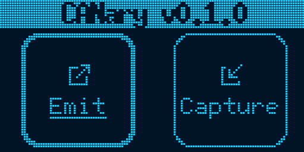

# CANary firmware

CANary firmware is the firmware for the CANary project. This project has the goal of making an independent CAN bus listener and emitter.

<p align="center">


</p>

This firmware was made for a STM32F103CB and bundles a graphical interface, a CAN bus controller and a SD card explorer. A CAN transceiver must be used along the STM32 to properly interface with the CAN bus.

## Compiling and flashing

### Building the firmware

To build the firmware, ensure you have the `thumbv7m-none-eabi` target installed for your Rust toolchain. This can be done with the following command :

```bash
rustup target add thumbv7m-none-eabi
```

> Note : due to the [rust-toolchain.toml](rust-toolchain.toml) file present in the directory, the target should automatically be installed on building.

You can then build the firmware using cargo :

```bash
cargo build --release
```

> Note : some flags are being implicitly set for the `cargo build` command through the [.cargo/config.toml](.cargo/config.toml) file.

The compiled binary can then be found in the `target/thumbv7m-none-eabi/release` directory.

### Flashing the firmware

Flashing makes use of the [probe-rs](https://github.com/probe-rs/probe-rs) tool. First install it using your method of choice by following the [probe-rs installation guide](https://probe.rs/docs/getting-started/installation/).

Then, connect your CANary through Serial Wire Debug (SWD) using the probe of your choice, preferably an ST-Link. More information can be found on the [Probe Setup page](https://probe.rs/docs/getting-started/probe-setup/#st-link) of probe-rs.

Power your CANary by plugging in a USB-C cable and test the connection :

```bash
probe-rs info
```

You should have an output listing the technical characteristics of the micro-controller. If you get an error, read through the error message to try and find the issue. The [probe-rs documentation](https://probe.rs/docs/) can be a great help in troubleshooting.

> Expected output :
>
> ```bash
> ARM Chip with debug port Default:
> Debug Port: DPv1, DP Designer: ARM Ltd
> └── 0 MemoryAP
>     └── ROM Table (Class 1), Designer: STMicroelectronics
>         ├── Cortex-M3 SCS   (Generic IP component)
>         │   └── CPUID
>         │       ├── IMPLEMENTER: ARM Ltd
>         │       ├── VARIANT: 1
>         │       ├── PARTNO: Cortex-M3
>         │       └── REVISION: 1
>         ├── Cortex-M3 DWT   (Generic IP component)
>         ├── Cortex-M3 FBP   (Generic IP component)
>         ├── Cortex-M3 ITM   (Generic IP component)
>         └── Cortex-M3 TPIU  (Coresight Component)
> ```

If all succeeded, you can now flash the firmware by using :

```bash
cargo embed --release
```

> If the firmware wasn't already, it will be built before being flashed onto the micro-controller.

### Debugging

Debugging is done through the RTT (Real-Time Transfer) protocol. Upon flashing the device, a RTT terminal should open and a debug output should be visible.

You also have the option to attach to an already running device using the `connect` profile :

```bash
cargo embed connect
```

> Note : the device must of course be connected via SWD to start RTT.

### Building and reading the docs

The firmware documentation is available through `cargo doc`. Run the following command to compile and open the doc :

```bash
cargo doc --open
```

## Technical details

To simplify development and ensure code quality and readability, a STM32 Hardware Abstraction Layer was used through the [`stm32f1xx-hal`](https://crates.io/crates/stm32f1xx-hal/) crate. This also allows us to use abstractions provided by the [`embedded-hal`](https://crates.io/crates/embedded-hal/) crate. Other hardware essential crates are [`cortex-m`](https://crates.io/crates/cortex-m/), [`heapless`](https://crates.io/crates/heapless/) and [`nb`](https://crates.io/crates/nb/).

As mentioned above, debugging is done through RTT with the [`rtt-target`](https://crates.io/crates/rtt-target/) and [`panic-rtt-target`](https://crates.io/crates/panic-rtt-target/) crates.

This firmware makes heavy use of Real-Time Interrupt-driven Concurrency through the [`rtic`](https://crates.io/crates/rtic/) crate. All execution related functions can be found in the [`mod@app`] module, while other modules contain abstractions essentials to the firmware.

Time on the device is managed through a [Monotonic](app::Mono) provided by the [`rtic-monotonics`](https://crates.io/crates/rtic-monotonics/) crate.

For the display, the [`embedded-graphics`](https://crates.io/crates/embedded-graphics/) crate was used in conjunction with the display driver for [`ssd1306`](https://crates.io/crates/ssd1306/) and [`tinybmp`](https://crates.io/crates/tinybmp/) for icons display. All icons used in the GUI are found in `src/icons` as monochrome `.bmp` files.

Finally a SPI SD Card driver was used through the [`embedded-sdmmc`](https://crates.io/crates/embedded-sdmmc/) crate.

### Build environment

Only a few dependencies are needed to build the firmware. The Rust toolchain needed is presented in the `rust-toolchain.toml` file. Other dependencies are `probe-rs` and `gcc` (or any other C compiler).
A `shell.nix` is provided to reproduce the build environment. All dependencies are listed in the `buildInputs` field of the Nix Shell (some of them are only necessary in Nix Shells like `pkg-config` and `udev`).

For `probe-rs` to work properly, the memory map of the target MCU needs to be provided. This memory map can be found in the `memory.x` file and should not be changed unless the target MCU changes. Other `probe-rs` related flags are configured in `Embed.toml`.

### Notes to maintainers

- The documentation for some of the functions of the `app` module cannot be generated through `cargo doc` due to the `rtic` macros. It is still available through the source code.
- All calls to `.expect(...)` in the source code should never `panic!`, they mark errors that should not or cannot happen. The provided message explains why. If the verb "should" is used, some logic error somewhere else in the code could still cause a `panic!`.

  Calls to `.unwrap()` mark places in the code that could benefit from better error handling. The errors mays not be recoverable but at least informing the user would be nice.
