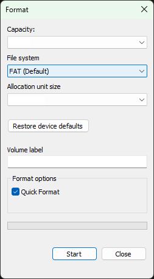

# CANary - Guide Utilisateur

Le CANary est un outil autonome d'émission et de capture de trames CAN.

Dans ce guide vous apprendrez à préparer une carte Micro SD, à émettre et capturer des trames avec le CANary et à récupérer les données de la carte Micro SD.

## Sommaire

- [CANary - Guide Utilisateur](#canary---guide-utilisateur)
  - [Sommaire](#sommaire)
  - [Préparer une carte Micro SD](#préparer-une-carte-micro-sd)

## Préparer une carte Micro SD

Le CANary fonctionne avec n'importe quelle carte Micro SD acceptant le protocole SPI et formatée au format FAT.

Formatter une carte Micro SD peut se faire simplement avec l'utilitaire de formatage Windows :

Il est recommandé pour la capture de créer un dossier dédié sur la carte Micro SD afin de ne pas noyer les fichiers pour l'émission sous ceux des captures.
