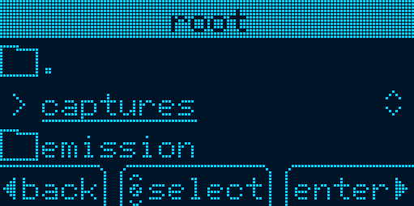

# CANary - Guide Utilisateur

Le CANary est un outil autonome d'émission et de capture de trames CAN.

Dans ce guide vous apprendrez à préparer une carte Micro SD, à émettre et capturer des trames avec le CANary et à récupérer les données de la carte Micro SD.

## Sommaire

- [CANary - Guide Utilisateur](#canary---guide-utilisateur)
  - [Sommaire](#sommaire)
  - [Préparer une carte Micro SD](#préparer-une-carte-micro-sd)
  - [Capturer des trames CAN](#capturer-des-trames-can)
  - [Récupérer une capture](#récupérer-une-capture)

## Préparer une carte Micro SD

Le CANary fonctionne avec n'importe quelle carte Micro SD acceptant le protocole SPI et formatée au format FAT.

Formatter une carte Micro SD peut se faire simplement avec l'utilitaire de formatage Windows :

<p align="center"></p>

Il est recommandé pour la capture de créer un dossier dédié sur la carte Micro SD afin de ne pas noyer les fichiers pour l'émission sous ceux des captures.

## Capturer des trames CAN

1. Insérez la carte Micro SD dans le CANary.

2. Allumez le CANary en le branchant via le port USB-C. Une LED clignote lorsque l'initialisation est terminée.
    > L'écran affiche les étapes de l'initialisation. Le démarrage de la carte Micro SD peut être long. Si la LED ne clignote pas après 2 minutes, l'initialisation a échoué : appuyez sur `[RESET]` ou débranchez/rebranchez le CANary. Si le problème persiste, vérifiez le formatage de la Micro SD.

3. Connectez via le connecteur dédié le CANary au bus CAN que vous voulez écouter.

4. Sélectionnez sur l'écran d'accueil du CANary l'option `Capture` puis faites `[OK]`.
    <p align="center"></p>

5. Sélectionnez le dossier dans lequel vous voulez que la capture soit enregistré en naviguant la Micro SD puis faites `[OK]` pour sélectionner le dossier.
    <p align="center"></p>

    > Note : si un nom de dossier est trop long, il sera raccourci et marqué d'un `~`.

6. Avant de commencer la capture, vous pouvez modifier les paramètres de celle-ci :
   - sélectionnez la Bitrate du bus avec `[UP]` et `[DOWN]` ;
   - activez le mode `Silent` avec `[RIGHT]`.
        > Le protocole CAN veut que l'envoi d'une trame sur le réseau soit validée une bit de réception. Le mode `Silent` empêche le CANary d'envoyer ce bit de réception, le rendant invisible sur le réseau CAN mais pouvant parfois empêcher le ou les émetteurs d'envoyer plus de trames.

    En haut de l'écran est affiché un rappel du dossier que vous avez sélectionné.
    <p align="center"></p>

7. Appuyez sur `[OK]` pour démarrer la capture. Le clignotement de la LED s’accélère.
    <p align="center"></p>

    > N'enlevez pas la carte SD ou ne débranchez pas le CANary pendant une capture, cela pourrait corrompre une partie de la capture ou de la carte Micro SD.

8. Appuyez de nouveau sur `[OK]` pour arrêter la capture. La LED clignote de nouveau normalement et l'écran affiche le nombre de trames capturées.
    <p align="center"></p>

    > Si l'écran affiche de nouveau `Standby`, aucune trame n'a été capturée.

9. Pour lancer une nouvelle capture dans le même dossier, appuyez simplement de nouveau sur `[OK]`. Pour lancer une capture dans un autre dossier, appuyez sur `[LEFT]` et reprenez à l'étape 4.

## Récupérer une capture

Pour récupérer les trames capturées, éteignez (débranchez) le CANary, enlevez-en la carte Micro SD et insérez là dans un ordinateur. Vous retrouvez alors des fichiers `.log` dans le(s) dossier(s) où vous avez fait les captures.

```text
.
├── captures
│  ├── 00013790.LOG
│  ├── 00214706.LOG
│  ├── 00234989.LOG
│  ├── 00374174.LOG
│  ├── 00388492.LOG
│  └── ...
└── ...
```

Le nombre dans le nom du fichier représente l'instant où la capture à démarrer, en nombre de millisecondes depuis le démarrage du CANary. Le CANary n'ayant pas connaissance de la date, ces noms de fichiers permettent simplement de savoir dans quelle ordre les captures ont été faites. Ainsi une capture avec un nombre plus grand aura été faites après une capture avec un nombre plus petit.

Les trames contenues dans les fichiers `.log` sont au format utilisé par [`can-utils`](https://github.com/linux-can/can-utils), à savoir :

```log
(0000375767.000000) can0 001#FF00000000000000
 ^^^^^^^^^┤         ^^^┤ ^^┤ ^^^^^^^^^^^^^^^┴─ 8-byte hexadecimal frame payload
          │            │   └─ 11-bit hexadecimal identifier
          │            └─ Can Interface - always can0 on a CANary
          └─ Time of capture (here in ticks since CANary boot)
```
